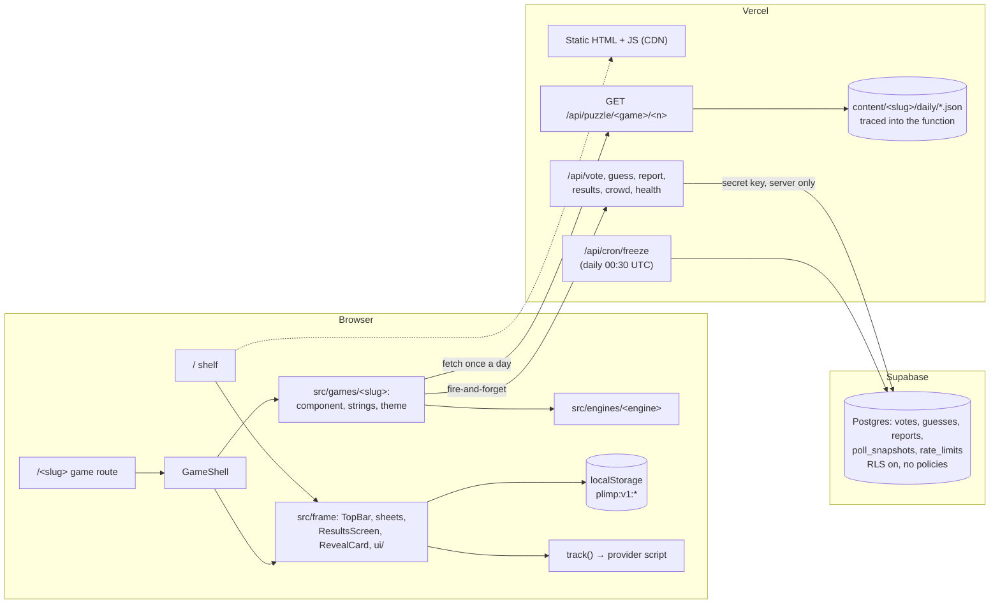

# Architecture

Plimp is one Next.js 16 app (App Router, static first) that hosts many small daily games. The
frame is shared and never changes; each game is a plugin with its own world.

## The frame (`src/frame/`)

- **Tokens** (`src/styles/tokens.css`): frame colours for light and dark, 4 px spacing, radii
  8/16, motion 150/250/400 ms ease-out. Tailwind maps them to utilities (`bg-frame-bg`,
  `rounded-control`, …) in `src/app/globals.css`. Reduced motion sets all motion tokens to 0.
- **Theme:** system by default; a light/dark choice is saved in `plimp:v1:meta`. An inline script
  in `<head>` (`theme-bootstrap.ts`) sets `data-theme` before first paint, so there is no flash.
  `data-theme-scope` forces a theme on a subtree (used by `/dev`).
- **GameShell** wraps every game: it emits the game's scoped `--game-*` variables
  (`game-theme.ts`: light, dark, and forced scopes, pure CSS), renders the TopBar and the
  help/stats/settings sheets, opens how-to on the first visit, and provides `useGame()`: puzzle
  number, mode, player state (`start`, `saveProgress`, `complete`), `playSound`, `track`,
  `openSheet`. The puzzle number is fixed for the life of the page: a round that runs past
  midnight is recorded as the puzzle it started as, and a notice offers a reload for the new one.
- **Primitives** (`ui/`): Button, Dialog/Sheet on the native `<dialog>` (Esc, inert background,
  Tab trap, focus return), Toast (live region), SegmentedControl (native radios).
- **Building blocks:** ResultsScreen, RevealCard (+ ReportDialog), OneTapPoll, ShareButton,
  Countdown, SoundToggle, ThemeSwitch, Mascot (placeholder when art is missing), ShelfTile.
  RevealCard takes one source or several (a reveal that compares facts). ResultsScreen has an
  `extras` slot (e.g. the poll), a label for the unlimited mode, and `summaryShowsStats` for a
  game-styled summary (a receipt) that shows the score, streak and countdown itself.
- **Shared game plumbing:** `useJson` loads what a game plays (a day's puzzle, an unlimited
  pool) once per URL, validated with the game's schema; `prefetchTodaysPuzzle` / `prefetchJson`
  start that request at module load, before hydration, and a failed early request is retried
  once. `prefs.ts` reads and saves game preferences (`meta.prefs`: display currency, distance
  unit) with a hydration-safe browser default. `game-route.ts` gives game route pages their
  metadata and the 404 for unreleased games.
- **Lazy loading** (`lazy.ts`): sheets, the report dialog and the shelf's "played today" badge
  (the only thing on the shelf that reads player storage, so Zod never reaches `/`) load on
  first use and are prefetched when idle; the boot work (`boot.ts`: meta, theme/sound sync, analytics provider,
  share arrival, return days) loads right after hydration.
- **Strings:** `strings.ts` (interface), `site-strings.ts` (server-only page copy). Formatting uses
  a fixed `UI_LOCALE` (`src/lib/locale.ts`) so prerendered HTML matches the client.

## Games and engines

- `src/games/types.ts` defines `GameDefinition`. `theme`, `mascot` and `launchDate` are required
  only when `status: 'live'`. `usesCrowdApi` lists `'polls'` and/or `'guesses'`.
- `src/games/registry.ts` holds every game's metadata (never components), with `getGame`,
  `liveGames`, `shelfGames` and `isGameReachable` (live, or dev / `ENABLE_DEV_ROUTES=1`).
- A game's route (`src/app/(games)/<slug>/page.tsx`) renders `GameShell` around the game's
  component. Unreleased games build as 404 in production.
- Engines (`src/engines/`) are shared mechanics (`choice`, `estimate`, `clue`, `map`), each added
  with the first game that needs it. `choice` exists (Sticker Shock): pure rules for rounds of 2–3
  options, daily lists and unlimited generators, a React hook for keys, focus, live announcements
  and animation hooks, and `ChoiceBoard` with render slots. `map` exists (Ping): pure rules for
  pin rounds scored relative to each round's scope, spherical helpers on d3-geo, and a lazy-loaded
  canvas `Globe` with lazy world-atlas shapes. See `src/engines/README.md`.
- Games whose scores run into the thousands pass `scoreBucket` (and `formatScore`) to
  `GameShell`: the stats chart then groups scores, while history keeps them exact.
- `credits` in a registry entry (fonts, art, data) are listed on the About page once it is live.
- Game-specific APIs live under `src/app/api/games/<slug>/`, e.g. Sticker Shock's Endless pool
  (`/api/games/sticker-shock/pool`), which ships its content files through
  `outputFileTracingIncludes` like the puzzle API.
- ESLint (`eslint.config.mjs`) enforces the plugin boundaries.

## Daily rotation (`src/lib/daily.ts`)

Puzzle number = the player's local calendar date minus the launch date, plus 1, computed on
calendar dates from `Intl`, so DST and time zones cannot shift it. The next puzzle unlocks at
local midnight (`nextPuzzleAt` binary-searches the next date change, which also handles skipped
midnights and date-line jumps). The puzzle API serves `n` only if `n` ≤ the puzzle number in
UTC+14 (`Etc/GMT-14`), the earliest time zone. Crowd data is keyed by puzzle number.

## Player state (`src/lib/storage.ts`)

Versioned keys `plimp:v1:*` (table in CLAUDE.md), validated with Zod on every read; a corrupt key
is reset on its own. Every access goes through a backend that never throws and falls back to
memory for the session when storage is blocked. A streak counts consecutive puzzle numbers;
unlimited play has its own key. `MIGRATIONS` is the hook for future versions. React reads storage
through `useSyncExternalStore` hooks (`src/frame/hooks.ts`), including cross-tab updates.

## Puzzle API

`GET /api/puzzle/<game>/<n>` reads `content/<game>/daily/<nnnn>.json` from disk at request time.
Released puzzles get `public, max-age=86400, s-maxage=31536000, immutable`; 404s are `no-store`.
`outputFileTracingIncludes` in `next.config.ts` ships the content files with the function. Content
is never imported into `src/` (lint), so future answers never reach client JavaScript.

## Crowd API and Supabase

- Tables (`supabase/migrations/…_crowd.sql`): `votes` (unique per poll and device), `guesses`
  (unique per game, puzzle, item and device), `reports` (status `new`), `poll_snapshots`,
  `rate_limits`. RLS is on for all, with no policies; table and function privileges are revoked
  from `anon` and `authenticated`. Only the server, with the secret key, reads or writes.
- Functions: `hit_rate_limit` (fixed window), `freeze_polls` (snapshots polls that are new or
  active in the last two days; prunes rate-limit windows older than a day), `poll_results`
  (latest snapshot, else live counts), `crowd_median`, `crowd_histogram` (log-scale bins).
- Routes (Node runtime) go through `CrowdStore` (`src/lib/crowd/store.ts`):
  - writes (`vote`, `guess`, `report`): JSON only, streamed size cap, Zod validation, game must be
    reachable and use the feature, guesses only for released puzzles, 30 writes per minute per
    `sha256(ip + IP_HASH_SALT + UTC date)`, duplicates answer 204 (idempotent);
  - reads (`results`, `crowd`): below 200 votes / 50 guesses (`src/lib/crowd/limits.ts`) only
    `{ ready: false, n }`; above, the numbers, cacheable at the CDN;
  - `health` pings the store; `cron/freeze` requires `Authorization: Bearer <CRON_SECRET>`.
- `CROWD_STORE=memory` swaps in an in-process store with the same semantics (tests, e2e, local
  development without Docker). It is refused on Vercel production.
- The SQL itself is tested in PGlite (`tests/unit/sql/`) on every CI run, including the access
  rules and `seed.sql`.
- `src/lib/supabase/types.ts` follows the `supabase gen types` shape; regenerate with
  `pnpm db:types` after a migration (needs `supabase start`).

## Content pipeline

Each game exports `contentSpec` from `src/games/<slug>/content.schema.ts`: a Zod schema per file
plus a `facts()` accessor (left out for files without facts, such as poll questions), and
optionally `check()` for rules across files (references, assets, what production allows). `pnpm content:validate` (`src/lib/content/validate.ts`) checks the
registry, every file against its schema, every fact's source fields (even if a schema forgets
them), that `checkedOn` is not in the future, 14 days of daily files ahead for live games (error)
and 30 (warning), and no `sample: true` when `CONTENT_MODE=production`. It runs in CI and before
every build. `pnpm csv-to-json` converts spreadsheet exports with a per-game mapping.

## Share and analytics

`buildShareText` (`src/lib/share.ts`): `<Game> #<n> · <score>`, an emoji grid, one teaser, and a
`?ref=share` link from `NEXT_PUBLIC_SITE_URL`. An unlimited run shares one line instead
(`<Game> <mode> · <result>`) and the link. A line containing a day's answer throws in
development and is dropped in production. Sharing uses the Web Share API, else the clipboard.

`track()` sends typed events to the provider chosen at build time (`none`, `plausible`, `umami`,
`vercel`; all cookieless). Providers load only in production builds and never on previews.

## Security

Headers come from `src/lib/security/headers.ts`: CSP, Referrer-Policy, X-Content-Type-Options,
X-Frame-Options, Cross-Origin-Opener-Policy, Permissions-Policy.

The CSP allows `'unsafe-inline'` scripts. Pages are prerendered, and Next.js 16 inlines its
hydration data as plain `<script>` tags: a nonce needs per-request rendering (no static pages, no
CDN caching), and SRI hashes cover external files only. Everything else is locked down:
`default-src 'self'`, `object-src 'none'`, `base-uri 'self'`, `frame-ancestors 'none'`,
`connect-src` limited to self and the analytics host, images from self and Supabase Storage.
Plimp renders no user-supplied HTML.

## Performance budget

| First-load JS (gzipped, `pnpm size`)      | Measured   | Budget (CI) |
| ----------------------------------------- | ---------- | ----------- |
| Bare Next 16.3 + React 19.3 "hello world" | 136 KB     |             |
| Shelf `/`                                 | 158 KB     | 185 KB      |
| Empty GameShell (`/dev/game-shell`)       | 183 KB     | 185 KB      |
| Each game page (found on its own)         | 207–211 KB | 215 KB      |

Plimp's own share is about 43 KB on a game page, half of it Zod (mini) plus storage validation;
the shelf skips that half by loading its "played today" badge lazily. A game page cannot: every
game validates its puzzle with Zod anyway. Keep new frame code lazy where it is not needed for
first paint. Lighthouse mobile on `/`: performance 0.94–0.98, accessibility 1.00 (CI asserts
≥ 0.9).

Turbopack's tree-shaking of Zod depends on which module reaches `zod/mini` first. Shared frame code
that validates game data (`useJson`) therefore validates through Standard Schema
(`schema["~standard"].validate`) with a type-only Zod import: a runtime import there once made
every game page 1.5 KB heavier. `pnpm size` measures every game route, so a shift like that fails
CI.

## Tests

- Vitest (`pnpm test`): daily rotation across time zones and DST, storage (blocked, corrupt,
  streaks, migrations), share, analytics, sound, formatting, registry and contrast, UI primitives
  and frame components (jsdom), API routes against the memory store, the SQL in PGlite, content
  validation, CSV import, the scaffolder.
- Playwright (`pnpm test:e2e`, mobile and desktop Chromium): pages in light and dark with axe,
  theme persistence without flash, `/dev`, dialogs, and an API smoke test.
- CI (`.github/workflows/ci.yml`): checks, scaffold check, build + budget + e2e + Lighthouse.
